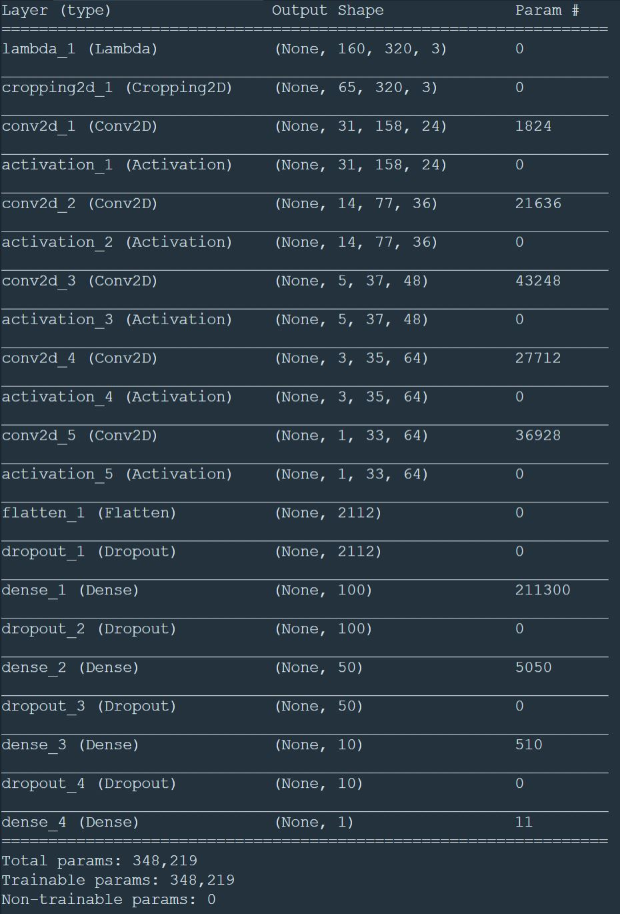

# Behavioral Cloning Project

[](http://www.udacity.com/drive)

---

**Behavioral Cloning Project**

The goals / steps of this project are the following:
* Use the simulator to collect data of good driving behavior
* Build, a convolution neural network in Keras that predicts steering angles from images
* Train and validate the model with a training and validation set
* Test that the model successfully drives around track one without leaving the road
* Summarize the results with a written report


[//]: # (Image References)

[image1]: ./examples/BC_1.JPG "Model Visualization"
[image2]: ./examples/images.png "Example Images"
[image3]: ./examples/run1.gif "Animation"
[image4]: ./examples/model.jpg "Model Summary"


## Rubric Points
### Here I will consider the [rubric points](https://review.udacity.com/#!/rubrics/432/view) individually and describe how I addressed each point in my implementation.  

---
### Files Submitted & Code Quality

#### 1. Submission includes all required files and can be used to run the simulator in autonomous mode

My project includes the following files:
* model.py containing the script to create and train the model
* drive.py for driving the car in autonomous mode
* model.h5 containing a trained convolution neural network 
* writeup_report.md or writeup_report.pdf summarizing the results

#### 2. Submission includes functional code
Using the Udacity provided simulator and my drive.py file, the car can be driven autonomously around the track by executing 
```sh
python drive.py model.h5
```
In this project, I used the training data provided by Udacity. It can be accessed from [here](https://d17h27t6h515a5.cloudfront.net/topher/2016/December/584f6edd_data/data.zip) The dataset contains JPG images of dimensions 160x320x3.

#### 3. Submission code is usable and readable

The model.py file contains the code for training and saving the convolution neural network. The file shows the pipeline I used for training and validating the model, and it contains comments to explain how the code works.

### Model Architecture and Training Strategy

#### 1. An appropriate model architecture has been employed

My model consists of a 5 layers conv2D and 4 layers of fully connected layers. I used the architechture from this Nvidia paper. The model includes RELU layers to introduce nonlinearity and the data is normalized in the model using a Keras lambda layer.

#### 2. Attempts to reduce overfitting in the model

The model contains dropout layers in order to reduce overfitting (model.py lines 21). 

The model was trained and validated on different data sets to ensure that the model was not overfitting (code line 10-16). The model was tested by running it through the simulator and ensuring that the vehicle could stay on the track.

#### 3. Model parameter tuning

The model used an adam optimizer, so the learning rate was not tuned manually (model.py line 25).

#### 4. Appropriate training data

Training data was chosen to keep the vehicle driving on the road. I used a combination of center lane driving, recovering from the left and right sides of the road ... 

For details about how I created the training data, see the next section. 

### Model Architecture and Training Strategy

#### 1. Solution Design Approach

##### Data Augmentation

The dataset contains only 8000 images, which are not sufficient to train the nueral network. I have used different techniques to augment the data. First, I have preprocessed the image using opencv gaussian blur to smoothen the image and converted it to RGB. Next, I filpped the image horizontally to using opencv flip function. The corresponding angle is inverted. I augmented these images to the dataset. It is also important to use the left and right images. This will improve the performance of the network when the car wander off to the sides. A small correction of 0.2 is added to the left image and subtracted from the right image. The main idea being the left camera has to move right to get to center, and right camera has to move left.
Data is augmented and generated on the fly using python generators(to generate data for training rather than storing the training data in memory). So for every epoch, the optimizer practically sees a new and augmented data set.

##### Model architecture

My first step was to use a convolution neural network model similar to the the model presented in this [paper](http://images.nvidia.com/content/tegra/automotive/images/2016/solutions/pdf/end-to-end-dl-using-px.pdf). I thought this model might be appropriate because the weights of this network are optimized to minimize the mean square error between the steering command output by the network and the command of the human driver. This model produced better results compared to other methods.

In order to gauge how well the model was working, I split my image and steering angle data into a training and validation set. I split the data into 80% of training set and 20% of validation set. I found that my first model had a low mean squared error on the training set but a high mean squared error on the validation set. This implied that the model was overfitting. 

To combat the overfitting, I modified the model and added dropout layers with 0.3 probability. Dropout was added to fully connected layers. The model was trained and tested on different datasets to ensure that the model was not overfitting. 

Then I trained the model for 2 epochs with Adam optimizer. The final step was to run the simulator to see how well the car was driving around track one. There were a few spots where the vehicle fell off the track. To improve the driving behavior in these cases, I retrained the model by adding relu layers and incresed the number of epochs to 3. I tested the model by running the simulator. At the end of the process, the vehicle is able to drive autonomously around the track without leaving the road.

#### 2. Final Model Architecture

The final model architecture (model.py lines 18-24) consisted of a convolution neural network with the following layers and layer sizes

Layer 1: Convolution layer with 24 5x5 filters, (2,2) strides, RELU activation
Layer 2: Convolution layer with 36 5x5 filters, (2,2) strides, RELU activation
Layer 3: Convolution layer with 48 5x5 filters, (2,2) strides, RELU activation
Layer 4: Convolution layer with 64 3x3 filters,  RELU activation
Layer 5: Convolution layer with 64 3x3 filters,  RELU activation
Layer 6: Fully connected layer with 100 neurons, Dropout(0.3), RELU activation
Layer 7: Fully connected layer with 50 neurons, Dropout(0.3), RELU activation
Layer 8: Fully connected layer with 10 neurons, Dropout(0.3), RELU activation
Layer 9: Fully connected layer with 1 neurons, Dropout(0.3), RELU activation

Here is a visualization of the architecture:

![alt text][image1]



#### 3. Training Set & Training Process

I used the dataset provided by Udacity to train the network. This dataset has images of the scene with corresponding steering angles. It also has left and right camera images along with the center camera images. Here are few example images from the dataset:

![alt text][image2]

I used images from all the three cameras by adding/subtracting a correction factor to the steering angles, by doing this we get 3x more images. I then augmented the dataset by flipping the images horizontally. The corresponding steering angles were inverted to match the driving behaviour.

After the collection process, I then preprocessed this data by adding gaussian blur with 3x3 kernel and converting to RGB image. I finally randomly shuffled the data set and put 20% of the data into a validation set. I used this training data for training the model. The validation set helped determine if the model was over or under fitting. The ideal number of epochs was 2. I used an adam optimizer so that manually training the learning rate wasn't necessary.

##### 4. Results

The model successfully navigates the car on the test track 1 witout pop up onto ledges or roll over any surfaces. However, the model failed to run on track 2 due to the complicated curves.
Here is an animation of the simulation result:

![alt text][image3]
